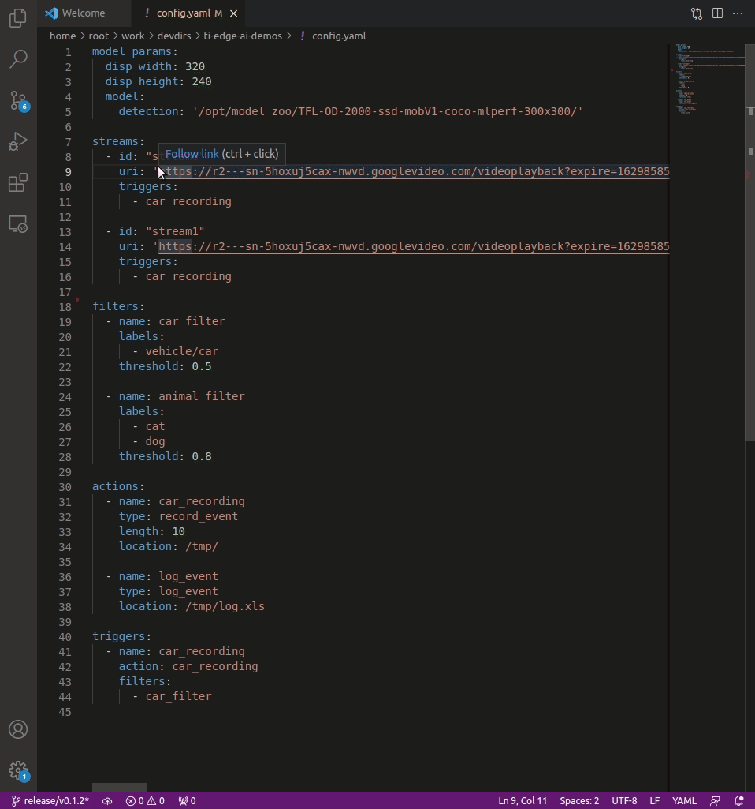

# TI EdgeAI Demos
> Demos to show the powerful capabilities of TI Edge AI SDK on Jacinto 7 platform

This demo shows how to create a multi-channel AI server with capabilities to detect user-specific objects and trigger actions based on inference results, which is a system that is typically found at "Smart City" applications.  It receives multiple RTSP video streams and detects objects based on the user's needs, and triggers actions such as video recordings and event logging. This demo could become a base system in "Smart City" applications like surveillance, traffic congestion control, smart parking use cases and more.

## Platform
To get started with the Jacinto 7 platform setup, please visit: 

## Building the Project

### 1. User Mode
To build the project, run the following commands:
```bash
python3 setup.py test
sudo python3 setup.py install
``` 

### 2. Developer Mode
If you are a project maintainer or just want to contribute to the project, we recommend building the project as:
```bash
sudo -H pip3 install pre-commit
python3 setup.py test
sudo python3 setup.py develop
```

## Running the Demo
```bash
smartcity.py
```

## Customizing the Demo

Different aspects of the project may be customized in the main configuration file: **config.yaml**. By default, the
demo will look for **config.yaml** in the same directory, but different configurations may be specified as the
following:
```bash
python3 ./smartcity.py -f alternative_configuration.yaml
```

### Anatomy of the Configuration File

The configuration should be specified in a YAML formatted file. Generally, it has the following structure:
```yaml
model_params:
  disp_width: 320
  disp_height: 240
  model:
    detection: '/opt/model_zoo/TFL-OD-2000-ssd-mobV1-coco-mlperf-300x300/'

streams:
  - id: "stream_one"
    uri: 'rtsp://some.rtsp.camera/stream
    triggers:
      - recording_trigger
      - logging_trigger

filters:
  - name: my_filter
    labels:
      - vehicle/car
    threshold: 0.5

actions:
  - name: recording_action
    type: record_event
    length: 10
    location: /tmp/

  - name: logging_action
    type: log_event
    location: /tmp/log.csv

triggers:
  - name: recording_trigger
    action: recording_action
    filters:
      - my_filter
  
  - name: logging_trigger
    action: logging_action
    filters:
      - my_filter
```

The following sections describe with detail the different components of the YAML.

#### Model Params

The model parameters are used to load the neural network weigths and related artifacts. It must contain the following elements:
| Parameter | Type | Description |
|-----------|------|-------------|
| disp_width | int | Used to scale the width of the post-processed image. As per now, it is recommended to keep it at 320. |
| disp_height | int | Used to scale the height of the post-processed image. As per now, it is recommended to keep it at 240. |
| model | object | Sub-object containing different configurations:<br>- **detection** (str): The absolute path to the detection model in the file system.|

#### Streams

The streams section consists of a list of individual stream descriptions. Each stream represents a camera to be captured and appended to the grid display. A maximum of 8 streams is supported. Each stream description contains the following fields:

| Parameter | Type | Description |
|-----------|------|-------------|
| id | str | A unique human-readable description |
| uri | str | A valid URI to play. Only H264 is supported at the time being. |
| triggers | list | A list of valid triggers (as specified by the name in the **triggers** section |

#### Filters

The filters section consists of a list of individual filter descriptions. The filter evaluates the prediction and, based on the configuration, decides if the actions should be executed or not.

| Parameter | Type | Description |
|-----------|------|-------------|
| name | str | A unique human-readable name of the filter |
| labels | list | A list of strings representing valid classes that will trigger the filter. Depends on the used model. |
| threshold | double | The minimum value that the predicted class must score in order to trigger the filter. |

#### Actions

The actions section consists of a list of individual action descriptions. The action is exectuted if the filter evaluates positevly to the prediction. Currently two actions are supported:

##### Record Event

| Parameter | Type | Description |
|-----------|------|-------------|
| name | str | A unique human-readable name of the action. |
| type | str | For recording must be **record_event**. |
| length | int | The length in seconds of the video recordings. |
| location | str | The directory where video recordings should be stored. The path must exist. |

##### Log Event

| Parameter | Type | Description |
|-----------|------|-------------|
| name | str | A unique human-readable name of the action. |
| type | str | For recording must be **log_event**. |
| location | str | The file to where the events will be logged to.|

#### Triggers

The triggers section consists of a list of individual trigger descriptions. A trigger combines an action and a list of filters. The rationale behind 
this design is to allow users to reuse filters and actions in different configurations. 

The triggers are assigned to each stream individually. When a prediction is made, it is forwarded to the filters. If any
of the filter is activated, the specified action will be executed.

| Parameter | Type | Description |
|-----------|------|-------------|
| name | str | A unique human-readable name of the trigger. |
| action | str | The name of a valid action as specified in the **actions** section. |
| filters | list | A list of filter names as specified in the **filters** section. |


### Example of Editing a Configuration

This section shows an example on how to properly edit a configuration file.

```bash
editor config.yaml
```




In order to create RTSTP URIs from a YouTube server for example, the following commands will help:
```bash
LINK="https://www.youtube.com/watch?v=faUNhaRLpMc&ab_channel=ProwalkTours"
youtube-dl --format "18[ext=mp4][protocol=https]" --get-url "$LINK"
```

The output link can be used in the `config.yaml` stream's URI as showed in the GIF above.
